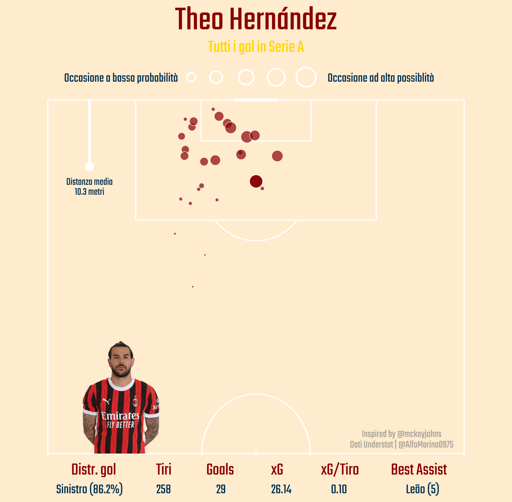
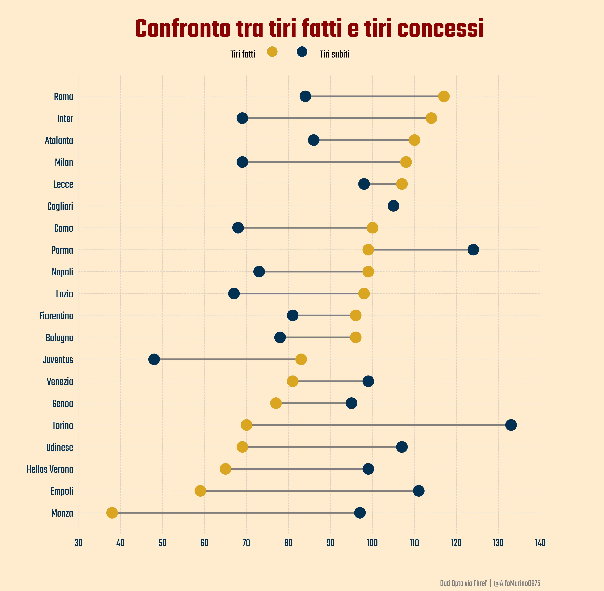
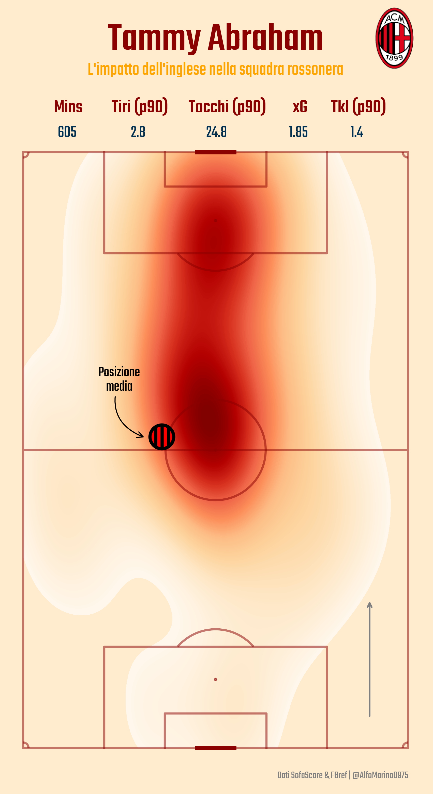
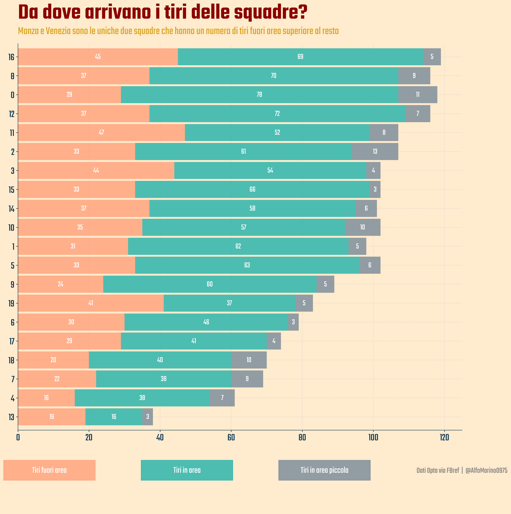
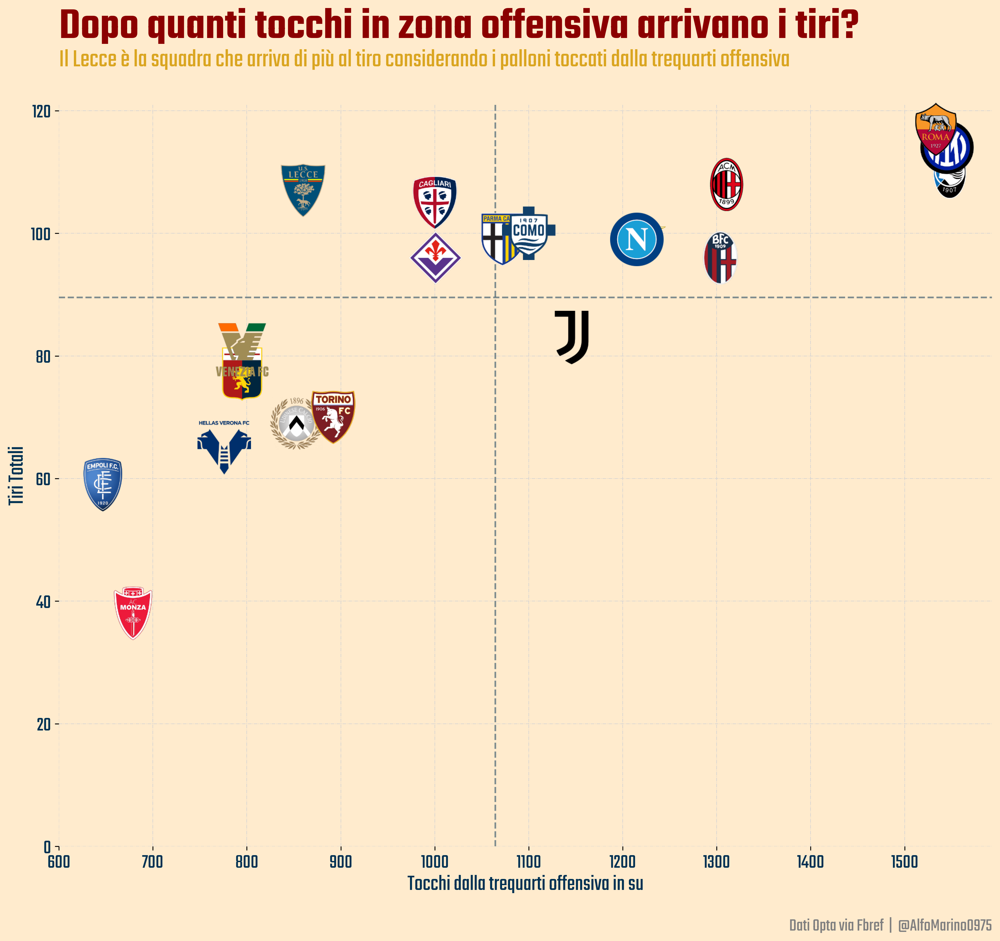

# Football-Viz

The repository contains codes for some of the soccer analysis I post on my personal social profiles. The visualizations are done mostly on Python, using Matplotlib and Mplsoccer.

## Visuals
### Map of Theo Hernandez's goals. ([Shotmap](Shotmap))

### Comparison of shots made and shots taken. ([Cleveland chart](ClevelandChart))

### Heat map of Abraham. ([Heatmap](Heatmap))

### Where do Series A teams shoot from? ([StackedBarplot](StackedBarplot))

### After how many touches in the offensive third do you get a shot? ([ScatterplotLogo](SCatterplotLogo))

