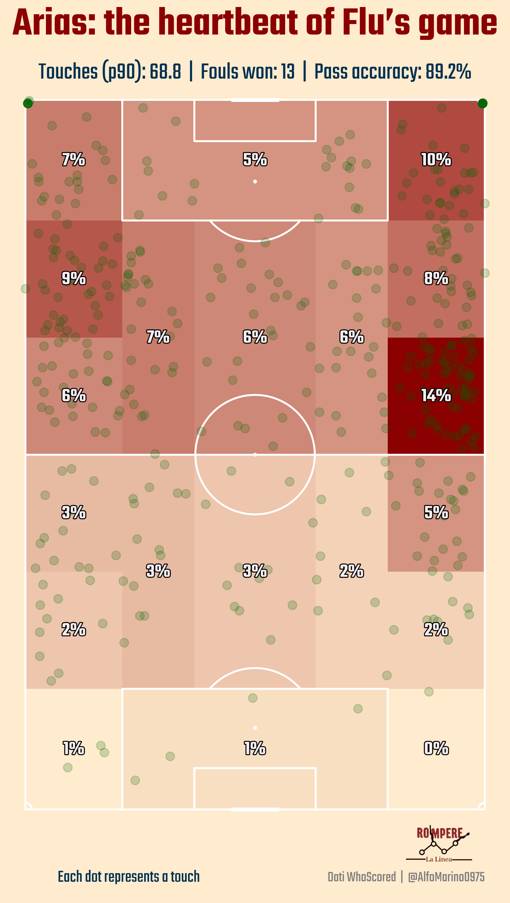
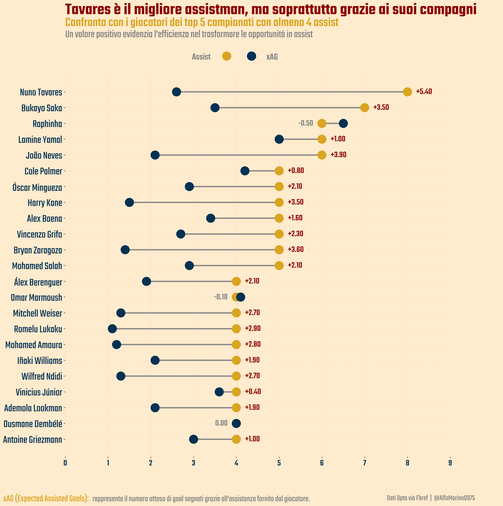
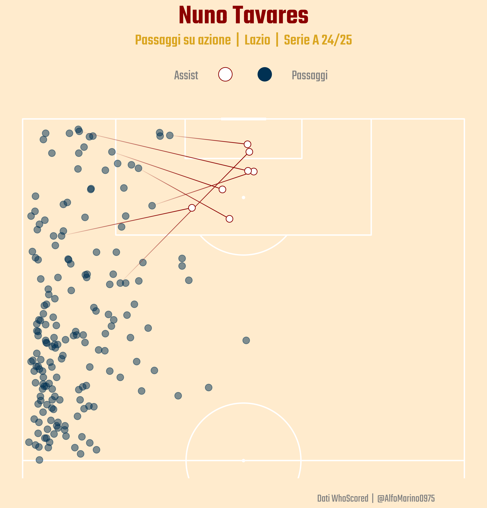
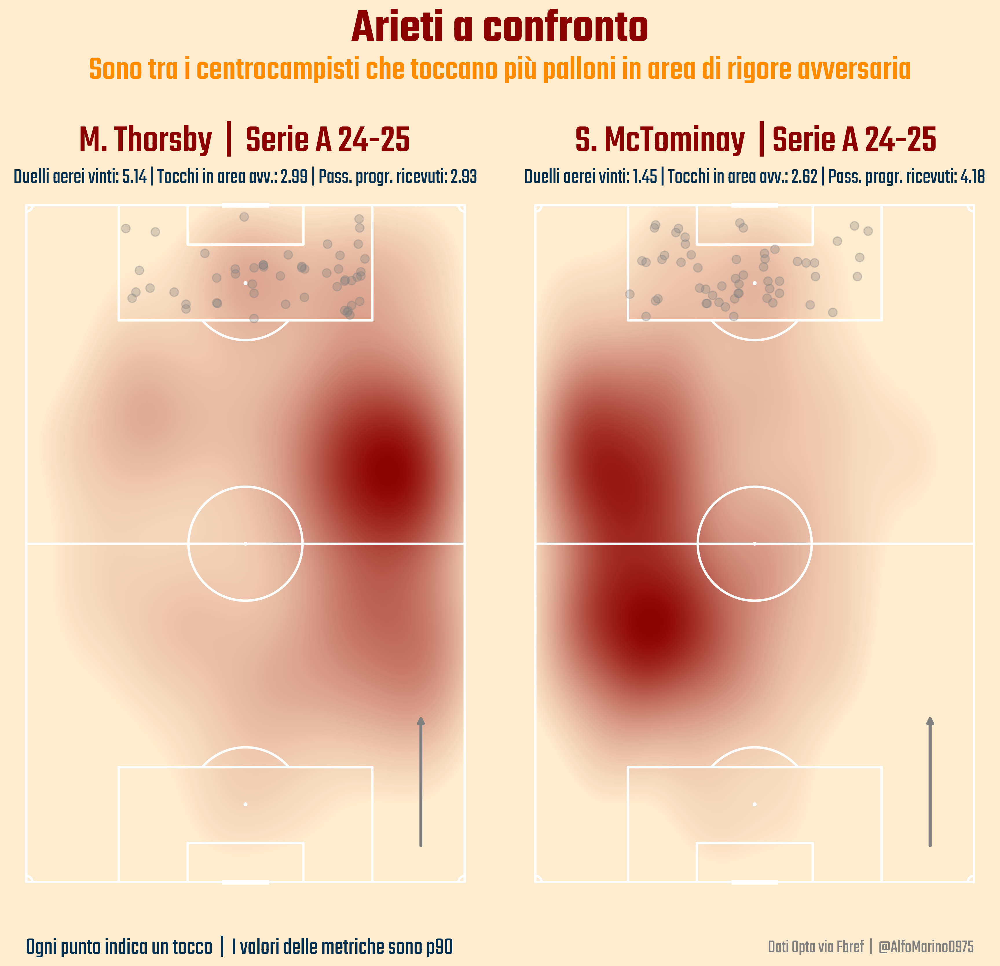
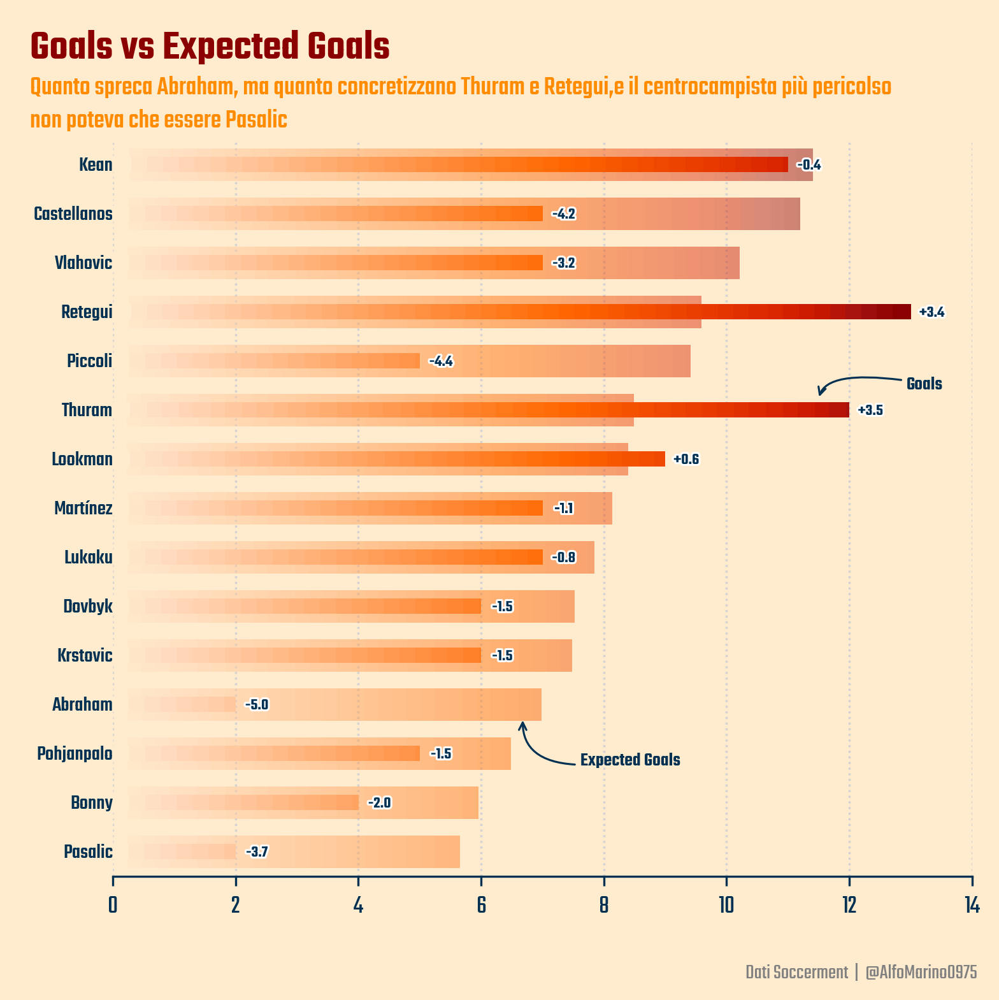
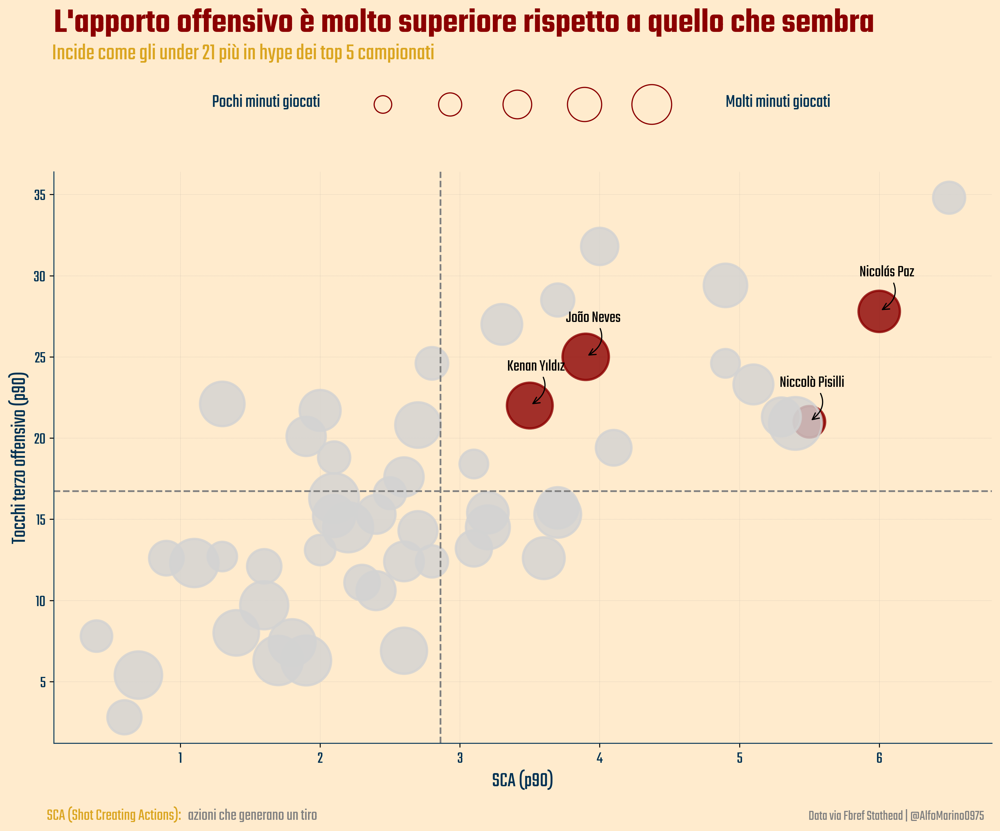
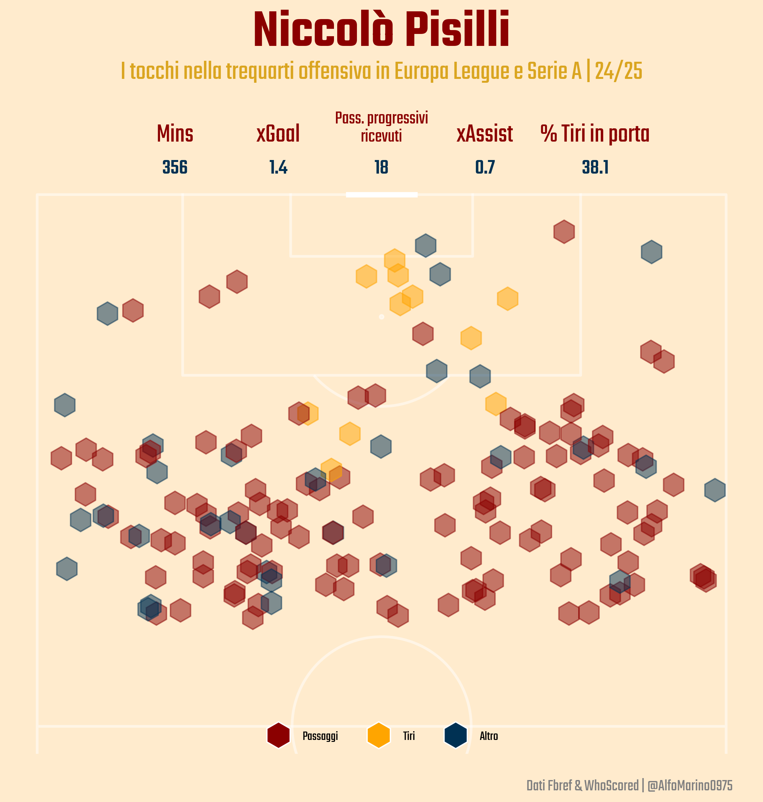
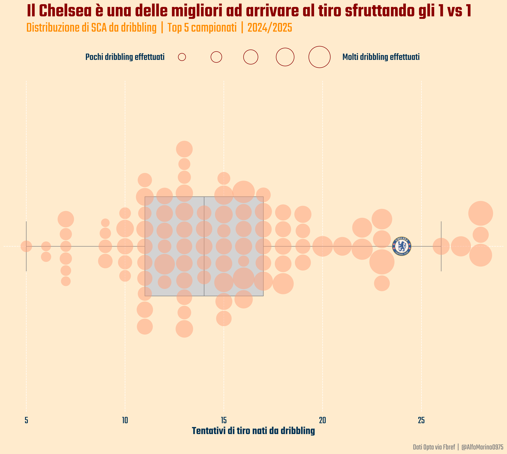

# Football-Viz

The repository contains codes for some of the soccer analysis I post on my personal social profiles ( [LinkedIn](https://www.linkedin.com/in/alfonso-marino-a5411b2b8/), [Instagram](https://www.instagram.com/romperelalinea/), [Twitter](https://x.com/AlfoMarino0975) )
. The visualizations are done mostly on Python, using Matplotlib and Mplsoccer.

## Visuals

### Map of touch percentage. ([PercentageTouch](PercentageTouch))

### Map of Theo Hernandez's goals. ([Shotmap](Shotmap))

### Comparison of shots made and shots taken. ([Cleveland chart](ClevelandChart))

### Map of Nuno Tavares' passes and assists. ([PassMap](PassMap))

### Heatmap comparison. ([Heatmap](Heatmap))

### Goals vs xG ([StackedBarplot](StackedBarplot))

### After how many touches in the offensive third do you get a shot? ([ScatterplotLogo](SCatterplotLogo))

### Who are the best young people for offensive production? ([ScatterPlotPlayers](ScatterPlotPlayers)]

### What does Pisilli do in the opposing half of the field? ([EventsPitch](EventsPitch)]

### Distribution of SCA Take-Ons among big 5 European Leagues. ([Beeswarm](Beeswarm)]

